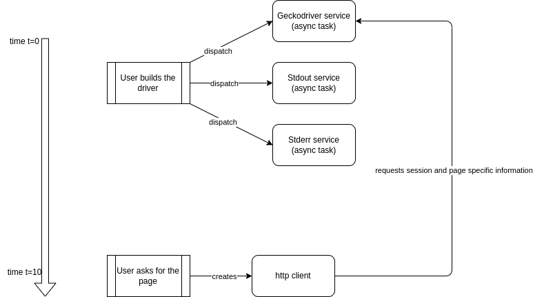

	

	
 

A naive webdriver implementation that will get you page you want both asyncronously and syncronously. Right now, you can only retrieve your page and save screenshot, yet the implementation is to come. 

The architecture works as follows. A user can create a DriverBuilder object which creates Firefox driver on build() call. In case of the user calls get() on the webpage, it initiates the session on firefox on headless mode and retrieves the webpage. You can check examples for more information.

The architecture is as follows.

## What is to come?
Currently, I am busy with the CDP (Chrome Driver Protocol) implementation which runs with websockets to run commands on DOM objects directly.
